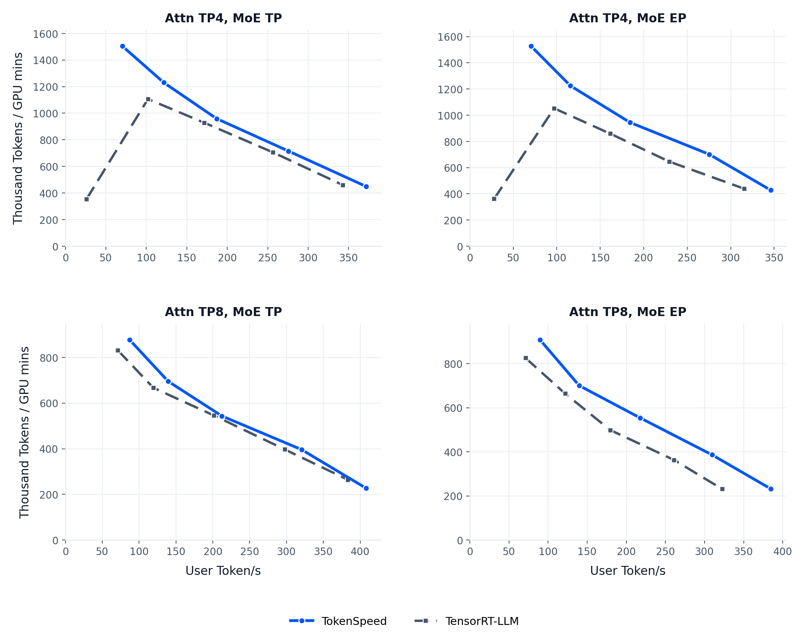

  

TokenSpeed is a speed-of-light LLM inference engine designed for **agentic workloads**, with TensorRT-LLM-level performance and vLLM-level usability. Our goal is to be the most performant inference engine for production agentic workloads.

Core components:

- **Modeling layer**: local-SPMD design with a static compiler that generates
  collective communication from module-boundary placement annotations, so users
  do not hand-write parallelism logic.
- **Scheduler**: C++ control plane and Python execution plane. Request
  lifecycle, KV cache ownership, and overlap timing are encoded as a
  finite-state machine, with safe KV resource reuse enforced by the type system at compile time.
- **Kernels**: pluggable, layered kernel system with a portable public API and
  a centralized registry including one of the fastest **MLA**
  (Multi-head Latent Attention) implementations on Blackwell for agentic workload.
- **Entrypoint**: SMG-integrated AsyncLLM for low-overhead CPU-side request
  handling.

## Performance Comparison

</img>

## Preview Status

This version is a preview release for reproducing the Kimi K2.5 on B200 and
TokenSpeed MLA on B200 results from the [TokenSpeed blog](https://lightseek.org/blog/lightseek-tokenspeed.html). Several major PRs are
still in progress and have not been merged yet.

Ongoing work includes:

- Model coverage: Qwen 3.6, DeepSeek V4, and MiniMax M2.7.
- Runtime features: PD, EPLB, KV store, Mamba cache, VLM, and metrics.
- Platform optimization: Hopper optimization, MI350 optimization, and related
  runtime improvements.

These features are still being cleaned up and will be merged into `main` over
the next few weeks. TokenSpeed is currently under heavy development and is
intended to showcase the new runtime design and technical direction. Do not use
this preview release for production deployments.

## Documentation

Start here:

- [Docs Index](https://lightseek.org/tokenspeed/)
- [Getting Started](https://lightseek.org/tokenspeed/guides/getting-started)
- [Launching a Server](https://lightseek.org/tokenspeed/guides/launching)
- [Model Recipes](https://lightseek.org/tokenspeed/recipes/models)
- [Server Parameters](https://lightseek.org/tokenspeed/configuration/server)
- [Compatible Parameters](https://lightseek.org/tokenspeed/configuration/compatible-parameters)
- [Parallelism](https://lightseek.org/tokenspeed/serving/parallelism)
